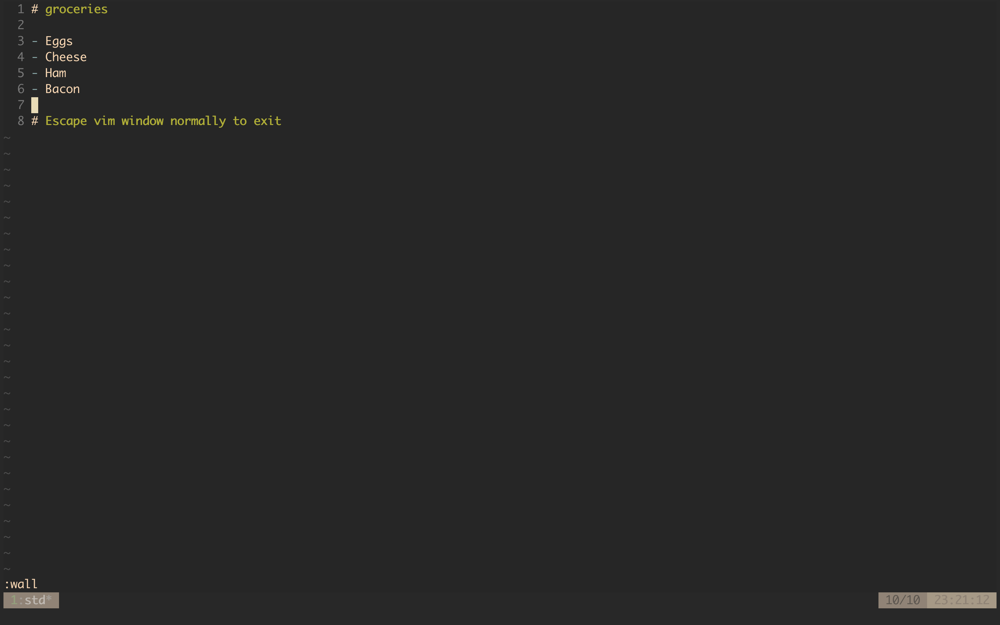
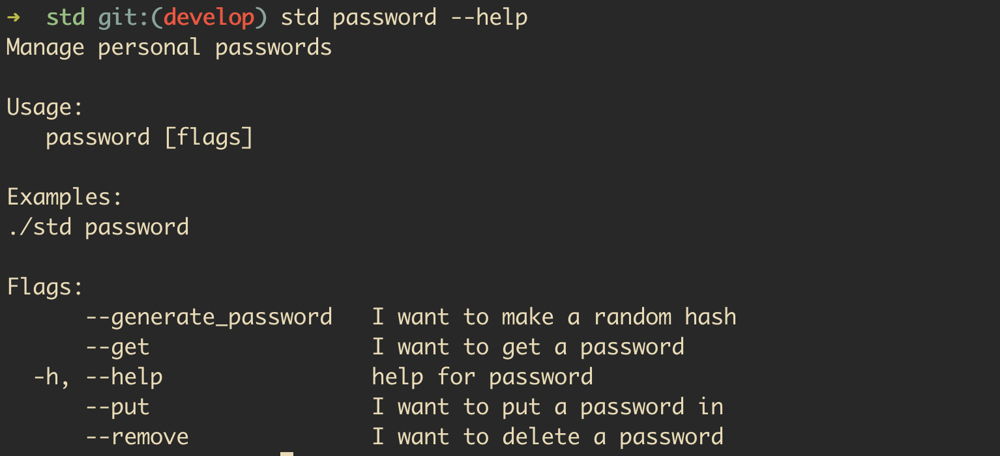
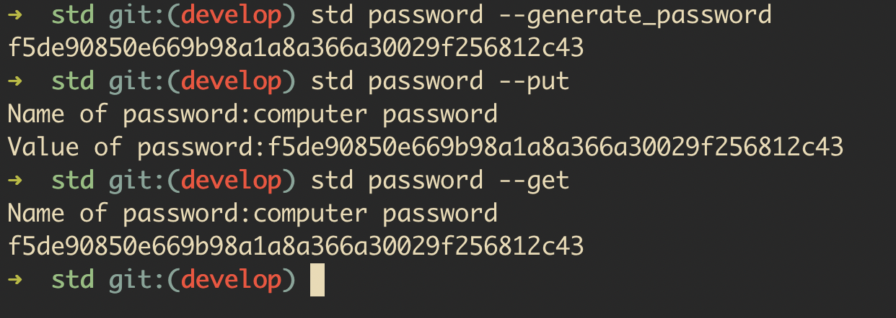

# STD

## A simple task manager

Welcome to STD (or as I like to call, shit to do)! This is a simple task manager that can be used to 
organize tasks from work, school, groceries, or anything else you want to keep a list of. 

STD is useful not only to keep work held in your work environment, but also because it is your own way 
of organizing what you want to have on your computer!

# Using STD 

If you just wish to use the project as a tool, [then run the binary!](https://github.com/benmorehouse/std/releases)

STD is simply a tool to keep track of your stuff without ever leaving the command line!

Here are all the available commands

You can say... create a list!

Then go and edit it!

You can also hold passwords!

And access them when you need.

Interested in the terminal setup you are seeing? Check out my dotfiles! https://github.com/benmorehouse/dotfiles

# Thanks and welcome to STD - A better way to manage your shit.
	
